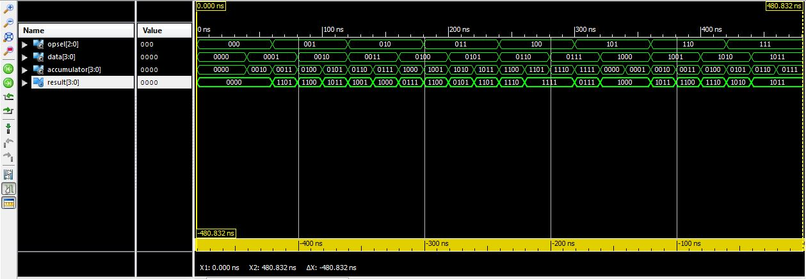
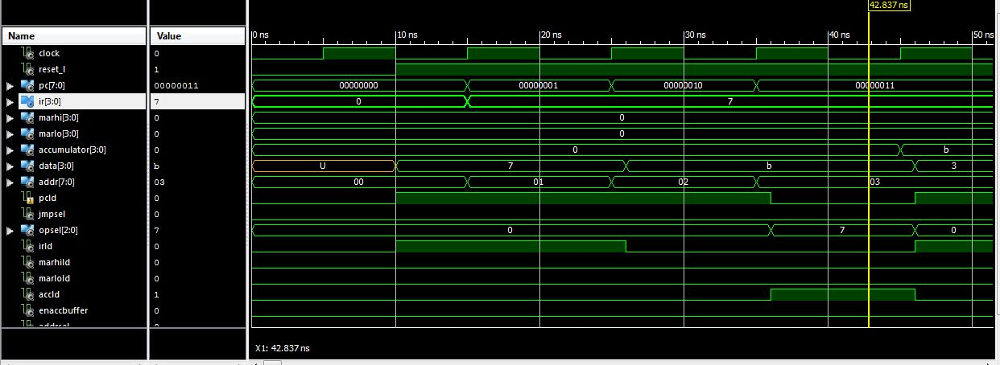

ECE281_PRISM
============

# Lab 4

In lab 4 we are asked to complete the code for an ALU and for the entire datapath subsystem in VHDL.


## ALU Shell

Below is a snapshot of the waveform produced by a completed ALU from the provided testbench



### Analysis
To ensure that the ALU was functioning as required I stepped through the waveform, instruction by instruction,
and compared each result with pen and paper calculations. I found that my ALU performed all the instructions
given in the testbench correctly. 

### Errors and Bugs
I chose to implement the multiplexer in the ALU with a case statement. The compiler threw an error when I
didn't sepcify `when others` 


## Datapath Shell

Below is a snapshot of the waveform produced by a completed ALU from the provided testbench



### Analysis

I checked my datapath in much the same way as the ALU. I stepped through the waveform, instruction by 
instruction, and took note of what operations were being performed at what times. I ensured that the 
operations executed correctly by comparing the results to pen and paper calculations. In all cases,
I found that my datapath performed as excpected. 

### Errors and Bugs

Implementation of the datapath was fairly straight forward. However, when writing the logical tests for
the if statements, I noticed that it is important to use lots of parenthesis otherwise the compiler will 
throw and error. For example, `elsif ((Clock'event and Clock='1') and MARLoLd = '1') then` is preferable to
`elsif (Clock'event and Clock='1' and MARLoLd = '1') then`. Notice the missing parenthesis around 
`Clock'event and Clock='1'` in the first example. 

## Datapath Program

The testing I did for the Datapath Shell set me up well to understand what was going on with the simulated
program. The code for the program is (or at least is closely approximated by) the following:

```VHDL
		   00	   7	LDAI	B		N	1	Y
		   01	   B				Y	0	N
	LOOP	   02	   3	ROR			N	0	Y
		   03	   4	OUT	3		N	1	Y
		   04	   3				Y	0	N
		   05	   0	NOP			N	0	N
		   06	   D	STA	HI		N	2	Y
		   07	   0				Y	0	N
		   08	   B				Y	0	N
		   09	   B	JN	LOOP		N	2	Y
		   0A	   2				Y	0	N
		   0B	   0				Y	0	N
	END	   0C	   9	JMP	END		N	2	Y
		   0D	   C				Y	0	N
		   0E	   0				Y	0	N
```

### Analysis

Broadly, the above program loads a B into the accumulator and performs a ROR on it until the result is positive. 

#### LDAI
Evidence for this step was given in the lab write up. Loads B into the accumulator

#### ROR
ROR is given by the opcode 3. This is evidenced by an 3 on the databus, directly followed by that value being 
loaded into the instruction register. Further evidence is the fact that the accumatlor contains the result of
a B being ROR.


#### OUT
OUT is given by opcode 4. This is evidenced by a 4 on the databus, dicectly followed by that value being
loaded into the instruction register. Out is directed at output port 3 as evidenced by the 3 directly following
the out command. 


#### STA
STA is given by the opcode D. This is evidenced by a D on the databus, directly being followed by that value
being loaded into the instruction register. STA is followed by OB meaning that the value stored into the 
register at 0B in memory. 


#### JN
JN is given by the opcode B. This is evidenced by a B on the databus, directly being followed by that value
being loaded into the instruction register. JN jumps back to the address given as the operand if the value 
in the accumulator is negative. The operand for this instruction is 02.


#### JMP

The instructions above, with the exception of NOP, loop until the accumulator contains 7. JMP is given by 
the opcode 9. Again, you can see that 9 is on the databus and then is passed into the instruction 
register. The operand that is passed along with it is 0C. 0C references the JMP command itself so the 
program ends in an infinite loop. 


